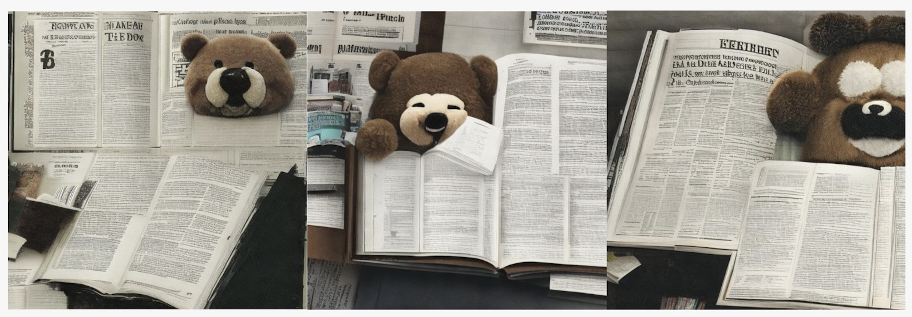
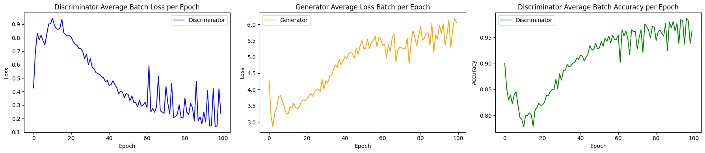
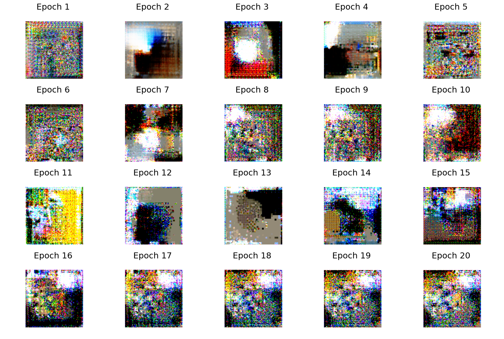
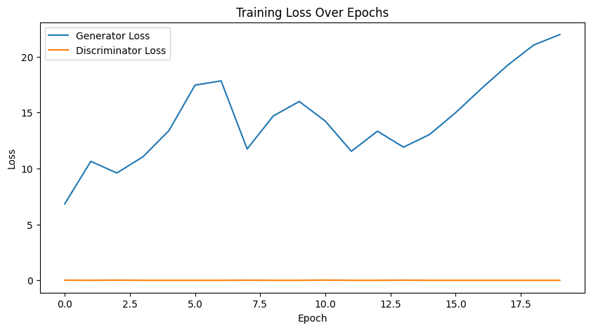

# Final Project Instructions to run the Code

In this project we implemented 3 models.
* Pre-trained LDM Model
* cGAN using AFHQ dataset
* cGAN BERT model usiing COCO dataset


# 1. Pretrained LDM Model

## Dependencies 

```cmd
pip install transformers==4.19.2 scann kornia==0.6.4 torchmetrics==0.6.0
pip install git+https://github.com/arogozhnikov/einops.git
```

## Running LDM Script

The file contains all the code that is necessary to run the model. It doesnt require additional file

* Load the code in colab and run Inferencing_LDM.ipynb cells 

## Results using LDM model




# 2. cGAN using AFHQ dataset
* run cgan_afhq.ipynb 

## Dataset 
Dataset can be downloaded from below menioned link
[https://www.kaggle.com/datasets/andrewmvd/animal-faces](https://www.kaggle.com/datasets/andrewmvd/animal-faces)

## Results




# 3. cGAN BERT model using COCO dataset
This project implements a Conditional Generative Adversarial Network (GAN) to generate images based on textual descriptions. The model uses a pre-trained BERT model for text encoding and a deep convolutional neural network for the generator and discriminator.

## Dataset

The model is trained on the COCO dataset, specifically the `train2017` subset along with its annotations. The COCO dataset contains images with corresponding textual descriptions (captions).

[https://cocodataset.org/#download](https://cocodataset.org/#download)

2017 Train Images is used in this project. It has roughly 118k images and is about 18 GB in size.

## Model Architecture

### Text Encoder

- **BERT-Based Text Encoder:** Uses a pre-trained BERT model to convert text descriptions into feature vectors.

### Generator

- **Input:** Concatenates noise vector and text embedding.
- **Architecture:**
  - Fully Connected Layer
  - Three Transposed Convolutional (Deconvolutional) Layers
  - ReLU activations followed by Tanh activation

### Discriminator

- **Input:** Takes an image and a text embedding.
- **Architecture:**
  - Three Convolutional Layers
  - LeakyReLU activations
  - Fully Connected Layer
  - Sigmoid activation
 

## Dependencies

- Python 3.x
- PyTorch
- torchvision
- transformers (Hugging Face)
- Pillow
- matplotlib
- numpy
- json

## Setup

There are 2 version of this model
* cgan_bert.ipynb
* cgan_bert_Pnp.ipynb

The cgan_bert.ipynb requires you to have COCO dataset available on local machine in order to run it 
cgan_bert_PnP.ipynb is Plug and Play file. Ways to get the COCO data set is coded in the file no extra files are required to run the file except for the dependencies

Below is the link to saved model weights of cgan_bert.ipynb

## Weights Download link
[https://drive.google.com/drive/folders/1LZYRykzSzItOhJKM_TqZmcfbYdAvOVbt?usp=sharing](https://drive.google.com/drive/folders/1LZYRykzSzItOhJKM_TqZmcfbYdAvOVbt?usp=sharing)

# Results





## ! Caution

COCO dataset is large and uses large amount of resources.
Make sure to change the path of COCO dataset if you are running cgan_ber.ipynb. And if your system runs out of memory (Out Of Memory Error:) try reducing the batch size
## Requirements

* Ubuntu 22.04, Nvidia Graphics Card atleast 40GB, 32GB cpu ram, Cuda 12.0  
* Python3.8 is required to run the LDM repository
* COCO Dataset


